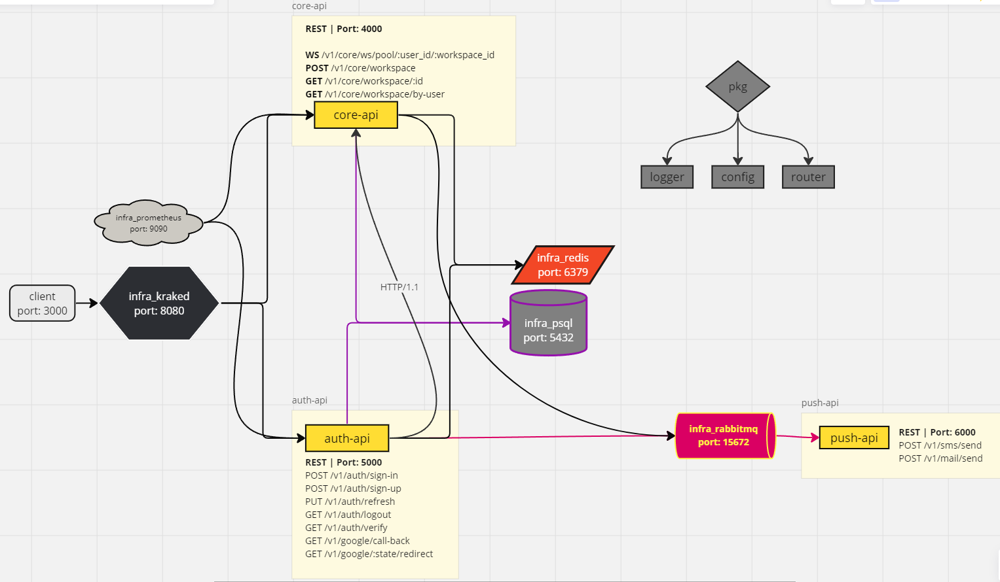
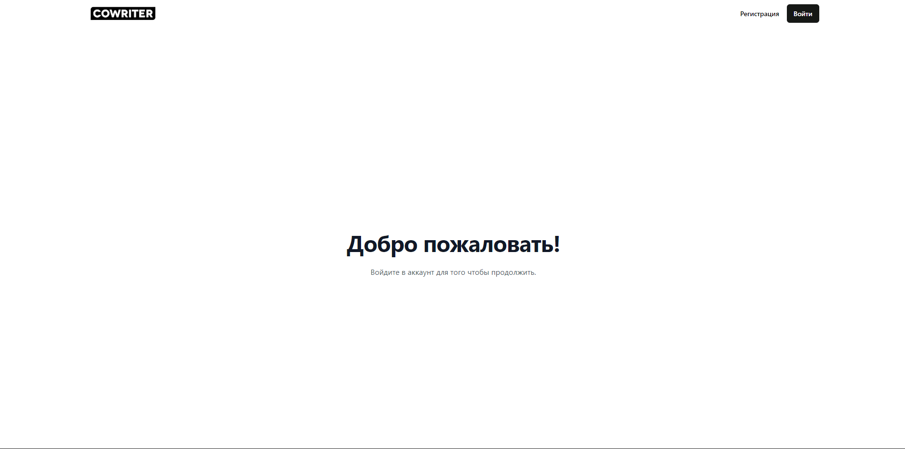
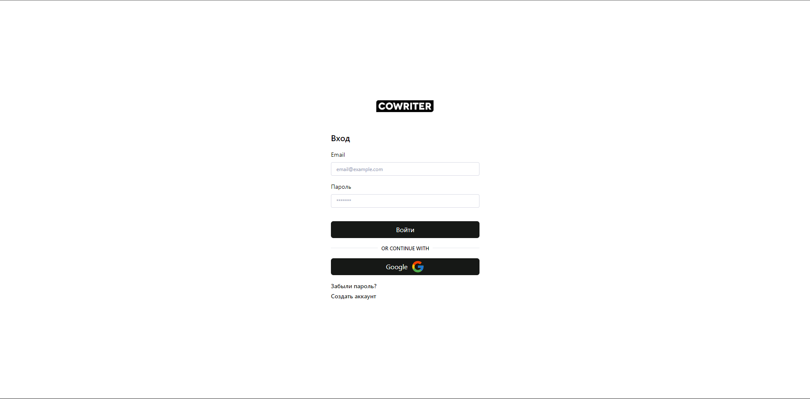
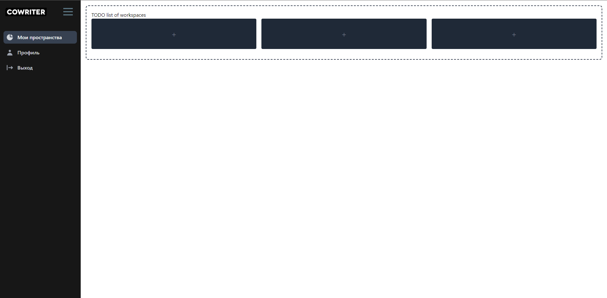
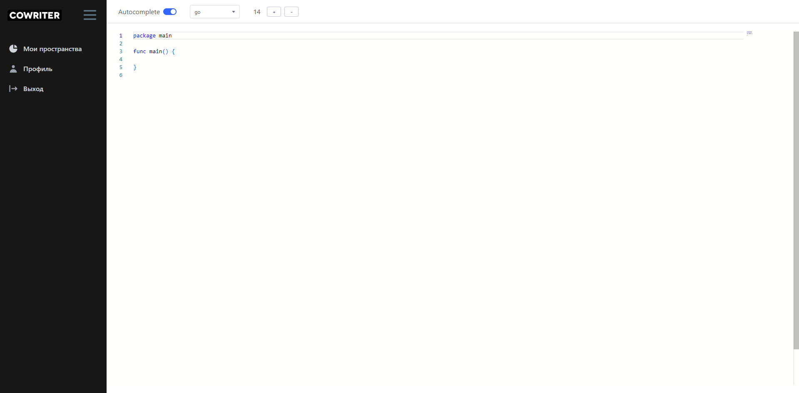

# cowriter

веб-приложение для совместной real-time разработки. Аналог code.avito.ru и code.o3team.ru. Однако, в будущем, проект будет расти в немного иное направление.

## Инфраструктура

В изображений ниже, приведена общая арихтектура проекта.
Весь процесс развертывания инфраструктуры на удаленный хост с помощью Docker Swarm & Portainer описан в папке /deployments. На данный момент папка скрыта, что-бы скрыть разные секретные ключи.

Проект был успешно развернут на Amazon EC2 инстансе, однако удаленный хост сейчас отключен, из за технических разработок.

## Services:

- Krakend
- Postgres
- Redis
- Prometheus
- RabbitMQ
- [auth-api](https://github.com/kadev-group/auth-api)
- [push-api](https://github.com/kadev-group/push-api)
- [core-api](https://github.com/kadev-group/core-api)
- [cowriter-web](https://github.com/kadev-group/cowrtiter-web)

## MVP

Ниже приведены, скриншоты текущей клиентской части приложения. Весь функционал, показанные на фото успешно работает. Однако, проект нуждается в дороботках даже для MVP версий.

### Contributing

Contributions are welcome! If you have any suggestions, improvements, or bug fixes, please create an issue or submit a pull request.

### License

This project is licensed under the MIT License.
